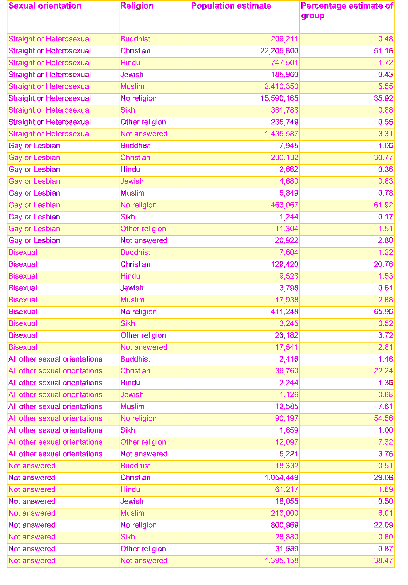

# Visualizing Identity: A Study of Sexual Orientation and Religion Across England and Wales

## Data

The data for this project was downloaded from the Office for National Statistics website (link in references). The original file included in the data file of the GitHub repository for this project includes the code book and metadata on sheets on the corresponding sheets.

the data was a product of the 2021 census – the sheets downloaded contained many variables including.... after looking

## Research question

## Filtered data

